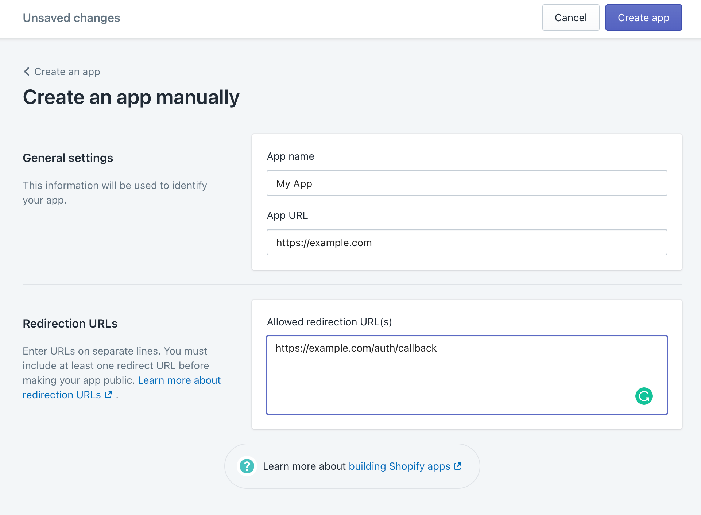
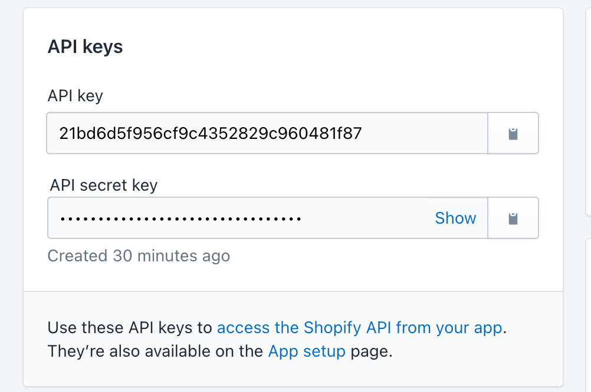
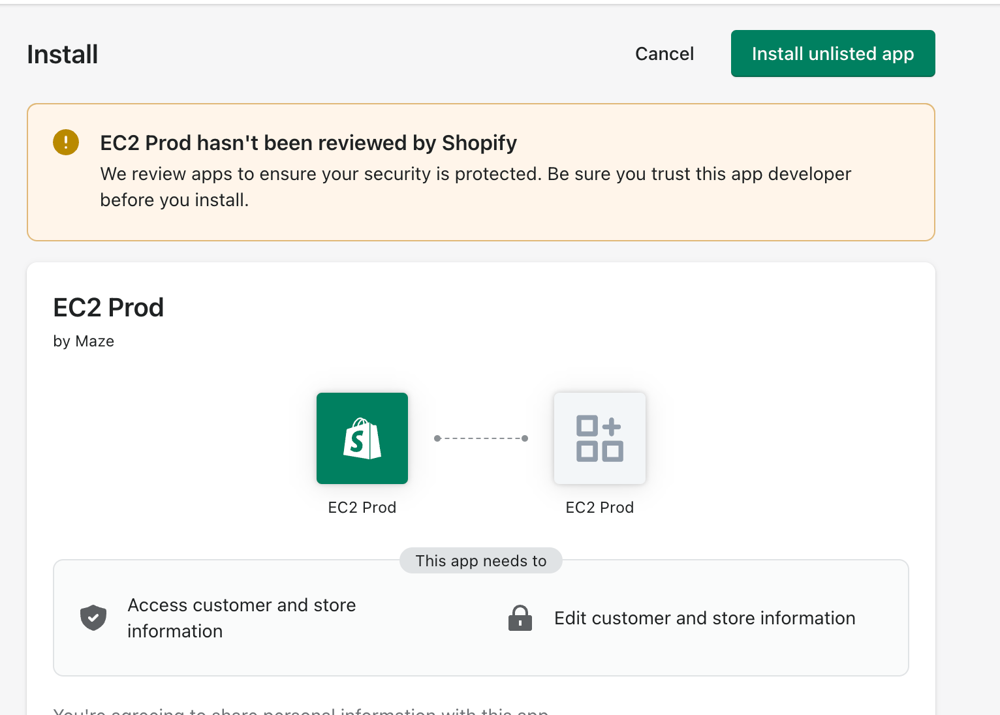

# Hosting NextJS Shopify App

## Intro

Given the nature of this application, a node server is necessary. Using an AWS EC2 instance, VPC, and reverse proxy handle the app's needs well. The following doc will instruct on how to accomplish this. It allows us to authenticate, install, and interface with the app without a local developer setup.

## Prerequisites

### Knowledge of the following is required::
  - AWS Web Services
  - Provisioning EC2 instances
  - NGINX
  - NodeJS version & package management
  - DNS & SSL certificate management
  - command line
  - SSH
  - Git
  - [Certbot](https://certbot.eff.org/)
  - [pm2](https://pm2.io/docs/plus/overview/)

## Contents

* [AWS Credentials](#header-aws-credentials)
* [Instance](#header-instance)
* [Server Configuration](#header-configuration)
* [DNS](#header-dns)
* [NGINX](#header-nginx-config)
* [SSL](#header-ssl)
* [Node](#header-node-setup)
* [App Setup & Serve](#header-app-setup)
* [Shopify Setup](#header-shopify)

## Instance

Launch an EC2 instance with the following specs:
- Ubuntu Server 22.04 LTS - **ami-085284d24fe829cd0**
- Instance type: **t2.medium**
- **Security group** with the following Inbound Rules

| Type | Protocol | Port range | Source |
| -- | -- | -- | -- |
| HTTP | tcp | 80 | 0.0.0.0/0 |
| HTTPS | tcp | 443 | 0.0.0.0/0 |
| ssh | tcp | 22 | secure option |

- Storage: **30 GiB gp2**

## Configuration

SSH into the newly created instance and install the following

```bash
sudo apt update && \
sudo apt-get install software-properties-common
curl https://raw.githubusercontent.com/creationix/nvm/master/install.sh | bash
curl -sS https://dl.yarnpkg.com/debian/pubkey.gpg | sudo apt-key add -
echo "deb https://dl.yarnpkg.com/debian/ stable main" | sudo tee /etc/apt/sources.list.d/yarn.list
sudo apt update && \
sudo apt install yarn nginx -y
```

### AWS Credentials

The application uses DynamoDB as a Datastore so our server must have permission to interact with Dynamo tables. We could use AWS Admin credentials, however that is a less than ideal practice. It is better to create custom roles and policies. You can find examples of these [here](2_IAM_Permissions.md)

Once you have the appropriate access keys, perform the following:

```bash
mkdir $HOME/.aws && touch $HOME/.aws/credentials
cat > $HOME/.aws/credentials <<EOL
[default]
aws_secret_access_key=<YOUR_ACCESS_KEY>
aws_access_key_id=<YOUR_SECRET_ACCESS_KEY>
region=<YOUR_REGION>
EOL
```

## DNS

For the next part you will need an FQDN, alternatively you can use your EC2 instance's public IP or IPv4 address. For this example we will use `example.com`

## NGINX

Change into nginx's `/etc` dir

```bash
cd /etc/nginx/sites-enabled/
```

Remove the `default` config

```bash
sudo rm default
```

Create your nginx config

```bash
sudo touch /etc/nginx/sites-available/example.com
```

Open and modify your config with the following

```
server {
    listen 80 default_server;
    listen [::]:80 default_server;
    server_name example.com www.example.com;

    location / {
        proxy_set_header X-Forwarded-For $proxy_add_x_forwarded_for;
        proxy_set_header Host $host;
        proxy_pass http://127.0.0.1:8080;
        proxy_http_version 1.1;
        proxy_set_header Upgrade $http_upgrade;
        proxy_set_header Connection "upgrade";
    }
```

Symlink your config

```bash
sudo ln -s ../sites-available/example.com
```

Restart *nginx* and open it up to the internets

```bash
sudo service nginx restart && sudo ufw allow 'Nginx Full'
```

You should be able to reach the server using its FQDN but will receive an error

## SSL

In order to work with Shopify we must use secure HTTP. We can use [Certbot](https://certbot.eff.org/) for this. Certbot can automatically configure NGINX for SSL/TLS. It looks for and modifies the server block in your NGINX configuration that contains a server_name directive with the domain name you’re requesting a certificate for. In our example, the domain is www.example.com.

Install Cerbot

```bash
sudo apt install certbot python3-certbot-nginx
```

Create certificate

```bash
sudo certbot --nginx -d example.com -d www.example.com
```

If all goes well you should see something like the following

```bash
Congratulations! You have successfully enabled https://example.com and https://www.example.com

-------------------------------------------------------------------------------------
IMPORTANT NOTES:

Congratulations! Your certificate and chain have been saved at:
/etc/letsencrypt/live/example.com/fullchain.pem
Your key file has been saved at:
/etc/letsencrypt/live/example.com/privkey.pem
Your cert will expire on 2023-07-07.
```

If you check your nginx config again, it should look something like the following

```shell
server {
    listen 80 default_server;
    listen [::]:80 default_server;
    root /var/www/html;
    server_name  example.com www.example.com;

    listen 443 ssl; # managed by Certbot

    # RSA certificate
    ssl_certificate /etc/letsencrypt/live/example.com/fullchain.pem; # managed by Certbot
    ssl_certificate_key /etc/letsencrypt/live/example.com/privkey.pem; # managed by Certbot

    include /etc/letsencrypt/options-ssl-nginx.conf; # managed by Certbot

    # Redirect non-https traffic to https
    if ($scheme != "https") {
        return 301 https://$host$request_uri;
    } # managed by Certbot
}
```

Test the certbot services with the following

```bash
sudo service certbot.timer status
sudo systemctl status certbot.timer
sudo certbot renew --dry-run
```

Test nginx config

```bash
sudo nginx -t
```

## Node Setup

We will use [NVM](https://github.com/nvm-sh/nvm) to manage our node version(s)

Install

```bash
curl -o- https://raw.githubusercontent.com/nvm-sh/nvm/v0.39.1/install.sh | bash
```

Restart you shell environment

```bash
source ~/.bashrc
```

Install node

```bash
nvm install 16.15.0
```

Install [Yarn](https://yarnpkg.com/)

```bash
npm install --global yarn
```

Install pm2

```bash
npm install -g pm2
```

## App Setup

Clone the repo & change into the repo directory

:info: You will have to authenticate with Git either via SSH keys, access token or basic auth in order to perform the following

```shell
git clone https://github.com/amplience/dc-extension-shopify.git
```

Install dependencies

```bash
yarn install
```

Create `.env`

```bash
cp .env.example .env
```

Build application

```bash
yarn build
```

Start Server

```bash
pm2 start all
```

You should see something like the following

```bash
[PM2] Applying action restartProcessId on app [all](ids: [ 0 ])
[PM2] [amplience](0) ✓
⇆ PM2+ activated | Instance Name: ip-172-31-91-177-403d | Dash: https://app.pm2.io/#/r/zrz1q66aas2ooc1
┌─────┬──────────────┬─────────────┬─────────┬─────────┬──────────┬────────┬──────┬───────────┬──────────┬──────────┬──────────┬──────────┐
│ id  │ name         │ namespace   │ version │ mode    │ pid      │ uptime │ ↺    │ status    │ cpu      │ mem      │ user     │ watching │
├─────┼──────────────┼─────────────┼─────────┼─────────┼──────────┼────────┼──────┼───────────┼──────────┼──────────┼──────────┼──────────┤
│ 0   │ amplience    │ default     │ 1.0.0   │ cluster │ 97656    │ 0s     │ 8    │ online    │ 0%       │ 31.2mb   │ shopify  │ disabled │
└─────┴──────────────┴─────────────┴─────────┴─────────┴──────────┴────────┴──────┴───────────┴──────────┴──────────┴──────────┴──────────┘
```

Check the status of the server

```bash
pm2 log

0|amplienc | 2022-07-08T17:54:18: info  - Loaded env from /home/.../.env
0|amplienc | 2022-07-08T17:54:18: > Ready on http://localhost:8080
```

You should be able to reach the app using its FQDN but it will not resolve. We must configure our app in the Shopify Admin

## Shopify

1. Navigate to the [Partner's Dashboard](https://partners.shopify.com/) and log in
1. Use or [create a Development store](https://help.shopify.com/en/partners/dashboard/development-stores#create-a-development-store)
1. [Create a new app](https://help.shopify.com/en/api/tools/partner-dashboard/your-apps#create-a-new-app) manually



Update the `.env` with the appropriate values after your app is created

```shell
SHOPIFY_API_KEY=YOUR_SHOPIFY_API_KEY
SHOPIFY_API_SECRET=YOUR_SHOPIFY_SECRET
SCOPES=read_products
DYNAMODB_TABLE=UNIQUE_TABLE_NAME
REGION=REGION
LOCAL_DB=false
```



Build app to reflect changes

```bash
yarn build
```

Restart the app

```bash
pm2 restart all
```

Finally, install the app for testing using the install URL

```shell
https://example.com/auth?shop=YOUR_SHOP.myshopify.com
```

Shortly after you will see the install screen (actual App Name will differ)




Click **Install** and begin using the app!